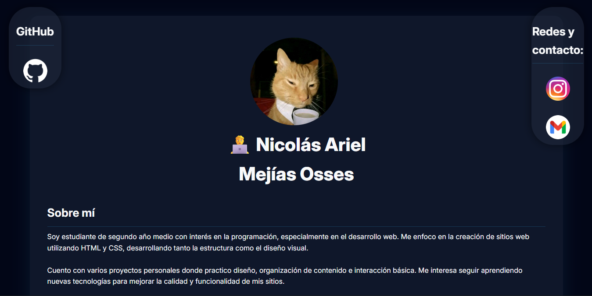
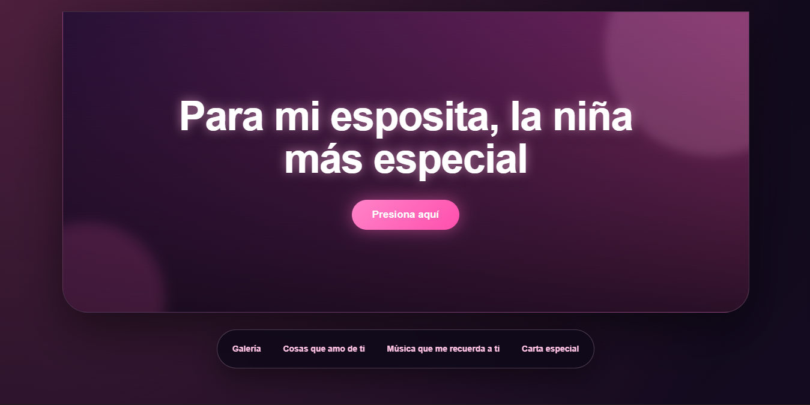

# 👨‍💻 Desarrollador Frontend en formación

---

## 🧑‍💻 Sobre mí

Soy **Nicolás Mejías**, estudiante y desarrollador frontend en formación.  
Estoy aprendiendo a crear sitios web claros, ordenados y visualmente atractivos usando **HTML**, **CSS** y **JavaScript**.

Me gusta construir proyectos desde cero, mejorar su diseño, ordenar el código y publicarlos en **GitHub Pages** para verlos funcionando como páginas reales.

---

## 🛠️ Tecnologías y herramientas

  

---

## 🚀 Proyectos destacados

Estos son algunos de mis proyectos frontend publicados con **GitHub Pages**.

---

### 🕹️ Proyecto principal: Top 5 Juegos Indie

Ranking visual de videojuegos indie con enfoque en jerarquía visual, imágenes, estructura clara y presentación ordenada del contenido.

**Tipo:** Proyecto visual / ranking  
**Stack:** HTML · CSS  
**Demo:** [Ver sitio](https://nm1412xx.github.io/top-5-indi/)  
**Repositorio:** [Ver repositorio](https://github.com/nm1412xx/top-5-indi)

---

### 👤 Tarjeta Personal

Tarjeta web enfocada en presentación personal, identidad visual, habilidades, intereses y proyectos.

**Tipo:** Tarjeta personal / presentación web  
**Stack:** HTML · CSS  
**Demo:** [Ver sitio](https://nm1412xx.github.io/tarjeta/)  
**Repositorio:** [Ver repositorio](https://github.com/nm1412xx/tarjeta)

---

### 🇯🇵 Galería de Japón

Galería web sobre lugares representativos de Japón, con imágenes, enlaces y una estructura visual simple y ordenada.

**Tipo:** Galería / sitio informativo  
**Stack:** HTML · CSS  
**Demo:** [Ver sitio](https://nm1412xx.github.io/japan/)  
**Repositorio:** [Ver repositorio](https://github.com/nm1412xx/japan)

---

### 🇨🇱 Galería de Chile

Sitio tipo galería sobre lugares turísticos y culturales de Chile.

**Tipo:** Galería / sitio informativo  
**Stack:** HTML · CSS  
**Demo:** [Ver sitio](https://nm1412xx.github.io/chile/)  
**Repositorio:** [Ver repositorio](https://github.com/nm1412xx/chile)

---

### 🛡️ Ciberseguridad

Sitio educativo sobre seguridad digital, ataques cibernéticos, prevención, glosario, fuentes y buenas prácticas en internet.

**Tipo:** Página educativa  
**Stack:** HTML · CSS · JavaScript  
**Demo:** [Ver sitio](https://nm1412xx.github.io/ciberseguridad/)  
**Repositorio:** [Ver repositorio](https://github.com/nm1412xx/ciberseguridad)

---

### 📚 Historia

Página educativa sobre la expansión territorial de Chile, incluyendo la Ocupación de la Araucanía y la Guerra del Pacífico.

**Tipo:** Sitio educativo / trabajo escolar  
**Stack:** HTML · CSS  
**Demo:** [Ver sitio](https://nm1412xx.github.io/historia/)  
**Repositorio:** [Ver repositorio](https://github.com/nm1412xx/historia)

---

### 💌 Roxy

Página personal con galería, música, carta y detalles especiales, creada como proyecto visual y emocional.

**Tipo:** Sitio personal  
**Stack:** HTML · CSS · JavaScript  
**Demo:** [Ver sitio](https://nm1412xx.github.io/roxy/)  
**Repositorio:** [Ver repositorio](https://github.com/nm1412xx/roxy)

---

### 🤖 Página de error

Página personalizada para mostrar un error de forma más visual y clara.

**Tipo:** Página 404 / error personalizada  
**Stack:** HTML · CSS  
**Demo:** [Ver sitio](https://nm1412xx.github.io/error/)  
**Repositorio:** [Ver repositorio](https://github.com/nm1412xx/error)

---

## 📌 Repositorios destacados

---

## 🎯 Objetivo

Seguir mejorando como desarrollador frontend, creando proyectos más completos, aprendiendo nuevas herramientas y fortaleciendo mis habilidades en:

- Diseño web
- Estructura HTML
- Estilos CSS
- JavaScript
- Responsive Design
- UI/UX
- Organización de proyectos en GitHub

---

## 📚 Actualmente aprendiendo

---

## 🏆 Trofeos y logros

  

---
## 🔥 Racha de contribuciones

---

## 📊 Actividad

  <picture>
    <source media="(prefers-color-scheme: dark)" srcset="https://raw.githubusercontent.com/nm1412xx/nm1412xx/output/snake-dark.svg" />
    <source media="(prefers-color-scheme: light)" srcset="https://raw.githubusercontent.com/nm1412xx/nm1412xx/output/snake.svg" />
    
  </picture>

---

## 👀 Visitas

  

---

## 🎧 Mi álbum favorito

  

---

## 🤝 ¿Colaboramos?

¿Tienes un proyecto en mente, feedback o una oportunidad?  
Estoy abierto a colaborar, aprender y seguir creando.

---

## 📬 Contacto

---

### 🚀 En constante aprendizaje y mejora como desarrollador frontend

