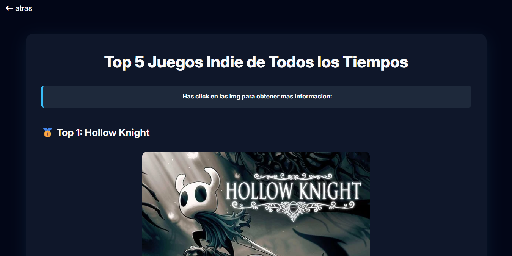
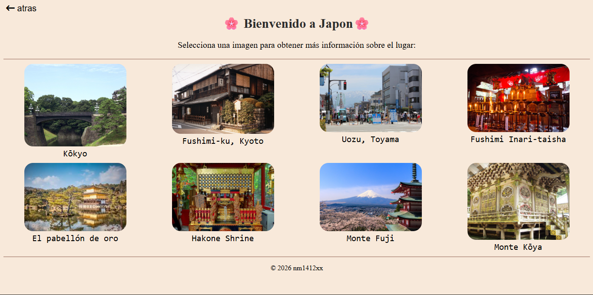

<!-- HERO -->

  

<!-- TYPING -->

  

<!-- ÁLBUM -->

  

<!-- FOTO -->

  

---

<h2 align="center">🧑‍💻 Sobre mí</h2>

Estudiante de segundo año medio enfocado en desarrollo web frontend. 
Me especializo en HTML y CSS, creando interfaces limpias, estructuradas y visualmente claras.

---

<h2 align="center">🛠️ Tecnologías</h2>

  

---

<!-- PROYECTOS -->
<h2 align="center">🚀 Proyectos Destacados</h2>

<table align="center" width="100%">
  <tr>
    <td width="50%" align="center" valign="top">
      <strong>🎮 Top 5 Juegos Indie</strong>  
      
      
 
        Proyecto frontend con HTML y CSS enfocado en ranking y jerarquía visual.
      

    </td>
    <td width="50%" align="center" valign="top">
      <strong>🗾 Galería de Japón</strong>  
      
      
 
        Web informativa con enfoque en diseño limpio y estructura de contenido.
      

    </td>
  </tr>
</table>

---
<h2 align="center">🎯 Objetivo</h2>

Seguir creciendo como desarrollador frontend, construyendo proyectos más completos y mejorando mis habilidades en diseño y experiencia de usuario.

---

<h2 align="center">🏆 Trofeos y Logros</h2>

---
<h2 align="center">🔥 Racha de Contribuciones</h2>

  

---
<h2 align="center">🐍 Actividad</h2>

  

---

<h2 align="center">📈 Visitas</h2>

  

---
<h2 align="center">🤝 ¿Colaboramos?</h2>

  ¿Tenés un proyecto en mente, feedback o una oportunidad? 
  Estoy abierto a colaborar y seguir aprendiendo.  
  <b>→ Contactame por Instagram o Email ↓</b>

---

<h2 align="center">📬 Contacto</h2>

  <!-- Instagram -->
  

<h2 align="center">📬 Contacto</h2>

  <!-- Instagram -->
  

  Si eres de <b>celular</b>, haz click en este botón para redactar un correo directamente en tu app de correo predeterminada:  
  <a href="mailto:nm1412xx@gmail.com?subject=Oportunidad%20en%20%5BNombre%20de%20la%20empresa%5D%20%E2%80%94%20Nos%20interesa%20tu%20trabajo%20en%20GitHub&body=Hola%20Nicolas%3A%0A%0AEspero%20que%20est%C3%A9s%20bien.%20Mi%20nombre%20es%20%5BTu%20nombre%5D%20y%20soy%20%5BTu%20cargo%5D%20en%20%5BNombre%20de%20la%20empresa%5D.%0A%0ARecientemente%20revisamos%20tu%20perfil%20de%20GitHub%20y%20quedamos%20muy%20impresionados%20con%20tu%20trabajo%20en%20%5Bmenciona%20proyecto%20o%20tecnolog%C3%ADa%20espec%C3%ADfica%20si%20aplica%5D.%20Tu%20experiencia%20y%20enfoque%20nos%20parecen%20muy%20alineados%20con%20lo%20que%20buscamos%20en%20el%20equipo.%0A%0AEn%20%5BNombre%20de%20la%20empresa%5D%20estamos%20%5Bbreve%20descripci%C3%B3n%20de%20lo%20que%20hace%20la%20empresa%20%2F%20el%20proyecto%5D.%20Por%20eso%2C%20nos%20gustar%C3%ADa%20explorar%20la%20posibilidad%20de%20que%20colabores%20con%20nosotros%20%5Bcomo%20empleado%20%2F%20contratista%20%2F%20freelancer%2C%20seg%C3%BAn%20aplique%5D.%0A%0A%C2%BFTendr%C3%ADas%20disponibilidad%20para%20una%20breve%20llamada%20esta%20semana%20o%20la%20siguiente%20para%20conocerte%20mejor%20y%20contarte%20m%C3%A1s%20detalles%20sobre%20la%20oportunidad%3F%0A%0AQuedo%20atento%20a%20tu%20respuesta.%0A%0ASaludos%20cordiales%2C%0A%5BTu%20nombre%5D%0A%5BTu%20cargo%5D%0A%5BNombre%20de%20la%20empresa%5D">
    
  </a>

  Si eres de <b>PC</b>, haz click en este botón para redactarme un correo en <b>Gmail Web</b>:  
  <a href="https://mail.google.com/mail/?view=cm&fs=1&to=nm1412xx@gmail.com&su=Oportunidad%20en%20%5BNombre%20de%20la%20empresa%5D%20%E2%80%94%20Nos%20interesa%20tu%20trabajo%20en%20GitHub&body=Hola%20Nicolas%3A%0A%0AEspero%20que%20est%C3%A9s%20bien.%20Mi%20nombre%20es%20%5BTu%20nombre%5D%20y%20soy%20%5BTu%20cargo%5D%20en%20%5BNombre%20de%20la%20empresa%5D.%0A%0ARecientemente%20revisamos%20tu%20perfil%20de%20GitHub%20y%20quedamos%20muy%20impresionados%20con%20tu%20trabajo%20en%20%5Bmenciona%20proyecto%20o%20tecnolog%C3%ADa%20espec%C3%ADfica%20si%20aplica%5D.%20Tu%20experiencia%20y%20enfoque%20nos%20parecen%20muy%20alineados%20con%20lo%20que%20buscamos%20en%20el%20equipo.%0A%0AEn%20%5BNombre%20de%20la%20empresa%5D%20estamos%20%5Bbreve%20descripci%C3%B3n%20de%20lo%20que%20hace%20la%20empresa%20%2F%20el%20proyecto%5D.%20Por%20eso%2C%20nos%20gustar%C3%ADa%20explorar%20la%20posibilidad%20de%20que%20colabores%20con%20nosotros%20%5Bcomo%20empleado%20%2F%20contratista%20%2F%20freelancer%2C%20seg%C3%BAn%20aplique%5D.%0A%0A%C2%BFTendr%C3%ADas%20disponibilidad%20para%20una%20breve%20llamada%20esta%20semana%20o%20la%20siguiente%20para%20conocerte%20mejor%20y%20contarte%20m%C3%A1s%20detalles%20sobre%20la%20oportunidad%3F%0A%0AQuedo%20atento%20a%20tu%20respuesta.%0A%0ASaludos%20cordiales%2C%0A%5BTu%20nombre%5D%0A%5BTu%20cargo%5D%0A%5BNombre%20de%20la%20empresa%5D" target="_blank">
    
  </a>

<!-- CIERRE -->

  

